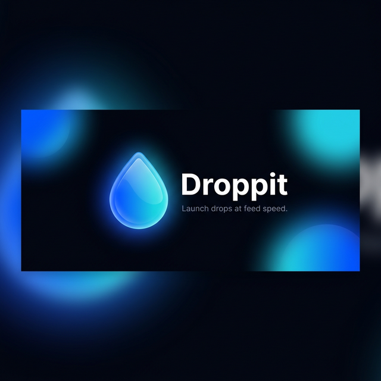

<p align="center">
  
</p>

<p align="center">
  <strong>Launch Base ERC-1155 drops directly from the social feed.</strong>
</p>

<p align="center">
  
  
  
  
  
</p>

## Official Links

- Website: [https://droppitonbase.xyz](https://droppitonbase.xyz)
- Farcaster: [https://farcaster.xyz/droppit](https://farcaster.xyz/droppit)
- X: [https://x.com/droppitonbase](https://x.com/droppitonbase)
- Email: `droppitonbase@gmail.com`

---

## 

Droppit makes onchain launches native to social. A creator tags `@droppit` on Warpcast, and our AI turns that social intent into a live, fully deployed sovereign contract on Base Mainnet in **under 60 seconds**.

Every drop gets its own **sovereign smart contract address** on Base, a **canonical mint page**, and an **in-feed Farcaster Mini App** so creation, sharing, and collection happen in one seamless flow. We reduce creator velocity from hours of complex Web3 UX to under a minute.

---

## 

1. **Zero-UI Agent Builder**: We utilize the CDP AgentKit and Google Gemini to abstract away complex dashboards. Our Farcaster AI agent orchestrates deployments directly from social intent.
2. **Gas-Optimized Base Architecture**: We don't use shared contracts. Every creator gets their own sovereign ERC-1155 contract. The entire execution layer lives entirely on Base to leverage its low fees using EIP-1167 Minimal Proxy Clones.
3. **Native "Drop-in-Feed"**: We bypass the app store and wallet-connect friction. With Farcaster Mini Apps (Frames v2) and Coinbase Smart Wallet integration, drops are pushed directly to the social feed.
4. **Encrypted Mint-to-Unlock**: We bridge onchain assets to offchain utility securely. Lock Shopify discount codes, secret links, or event barcodes behind an offchain AES-256 envelope that only unlocks for wallets holding the onchain NFT.

---

## 

### 🚀 Creator-Friendly Drop Generator
Two first-class creation paths. Web creators get a step-by-step wizard with live preview. Farcaster creators just cast and go.

### ⚡ Gas-Optimized Onchain Architecture
Every drop deploys its own ERC-1155 contract via the `DropFactory` using [EIP-1167 Minimal Proxy Clones](https://eips.ethereum.org/EIPS/eip-1167) — one contract per drop with minimal gas overhead.

### 🔐 Mint-to-Unlock / Encrypted Content
Creators can attach a secret message (passwords, alpha, event codes) that is **encrypted at rest** (AES-256-GCM) and revealed only to wallets that own the NFT. Decryption requires a signed nonce challenge + onchain ownership proof.

### 🖼️ Farcaster Mini Apps
Every drop has interactive Mini App endpoints. Collectors can mint richly directly in Warpcast. Creators get deploy Mini Apps with secret input, high-res upload, and auto-deploy support.

### 🛡️ Trust-First Minting
The mint page prominently displays the creator identity (wallet-linked handle), drop contract address, factory address, implementation address, and network — all verifiable on the Base explorer.

### 📊 Creator Analytics
Private per-drop stats: views, mints, conversion rate, top referrers, and revenue breakdown (creator proceeds vs. protocol fees).

---

## 

```
droppit/
├── droppit-contracts/          # Foundry — EVM smart contracts
│   ├── src/
│   │   ├── Drop1155.sol        # ERC-1155 implementation (mint, withdraw, locked commitment)
│   │   └── DropFactory.sol     # Clone factory (EIP-1167 + protocol fee config)
│   ├── test/                   # Forge tests
│   └── script/                 # Deployment scripts
│
├── droppit-web/                # Next.js 16 (App Router) — Frontend + API
│   ├── src/
│   │   ├── app/
│   │   │   ├── create/         # Drop creation wizard
│   │   │   ├── drop/           # Canonical mint page
│   │   │   └── api/            # Complete API routes
│   │   │       ├── agent/      # AI intent parser
│   │   │       ├── attribution/# View and mint attribution
│   │   │       ├── creator/    # Creator profiles
│   │   │       ├── drop/       # Locked content unlock
│   │   │       ├── drops/      # CRUD + publish lifecycle
│   │   │       ├── frame/      # Farcaster Frame & Mini App endpoints
│   │   │       ├── identity/   # Identity and auth
│   │   │       ├── og/         # Dynamic OG image generation
│   │   │       ├── receipt/    # View receipt endpoints
│   │   │       ├── stats/      # Creator analytics
│   │   │       ├── upload/     # Artwork upload
│   │   │       └── webhooks/   # Neynar webhook ingestion
│   │   └── lib/
│   │       ├── crypto/         # AES-256-GCM encryption
│   │       ├── validation/     # Shared input validators
│   │       ├── agent.ts        # Gemini + CDP AgentKit initialization
│   │       └── intent-parser.ts # Cast → drop intent extraction
│   ├── supabase/
│   │   ├── schema.sql          # Canonical DB schema (source of truth)
│   │   └── migrations/         # Forward migrations
│   └── scripts/
│       └── check-schema-conformance.ts  # CI schema drift detection
│
├── droppit-web/BRANDING.md                 # Official brand guidelines & assets
├── litepaper.md                # Droppit Litepaper documentation
└── product-spec.md             # MVP Product Specification
```

---

## 

| Layer | Technology |
|-------|-----------|
| **Smart Contracts** | Solidity ^0.8.20, Foundry, OpenZeppelin Clones + Upgradeable |
| **Frontend** | Next.js 16 (App Router), React 19, TailwindCSS 4 |
| **Web3** | viem, Wagmi, Coinbase OnchainKit (Smart Wallet + Passkeys) |
| **AI Agent** | CDP AgentKit, LangChain, Google Gemini 2.5 Flash |
| **Farcaster** | Neynar (webhooks + HMAC verification), Farcaster Mini Apps, custom Frame builder |
| **Database** | Supabase (PostgreSQL) — 7 tables, schema-checked in CI |
| **Storage** | Pinata (IPFS pinning for artwork + metadata) |
| **Security** | AES-256-GCM locked content encryption, challenge nonces, commitment validation |
| **Network** | Base (Mainnet + Sepolia) |
| **Testing** | Vitest (unit), Foundry (contracts), schema conformance checks |

---

## 

### Base Mainnet
- **DropFactory**: [`0x2D42cEd72a1babf630Fe6bFEB70B43491dB20608`](https://basescan.org/address/0x2D42cEd72a1babf630Fe6bFEB70B43491dB20608)
- **Drop1155 Implementation**: [`0x36D14123b868E385dfA10754bE960215ca294EA6`](https://basescan.org/address/0x36D14123b868E385dfA10754bE960215ca294EA6)

---

## 

```
┌─ Draft Phase ──────────────────────────────────────────┐
│  Frame input → validate → store in locked_content_draft │
│  (plaintext staging column, never in locked_content)    │
└─────────────────────────────────────────────────────────┘
                          │
                    [Publish API]
                          │
┌─ Publish Phase ─────────────────────────────────────────┐
│  1. Resolve plaintext (body override > staged draft)    │
│  2. Validate salt (0x + 64 hex chars)                   │
│  3. Recompute commitment = keccak256(salt ‖ plaintext)  │
│  4. Reject if recomputed commitment ≠ submitted value   │
│  5. Encrypt with AES-256-GCM → write to locked_content  │
│  6. Clear locked_content_draft → null                   │
└─────────────────────────────────────────────────────────┘
                          │
                    [Unlock Flow]
                          │
┌─ Unlock Phase ──────────────────────────────────────────┐
│  1. Issue time-bound nonce (wallet + contract scoped)   │
│  2. Verify wallet signature                             │
│  3. Burn nonce (anti-replay)                            │
│  4. Verify onchain NFT ownership (balanceOf)            │
│  5. Decrypt AES-256-GCM → return plaintext              │
│  6. Serve with no-store/no-cache headers                │
└─────────────────────────────────────────────────────────┘
```

---

## 

### Prerequisites

- [Node.js](https://nodejs.org/) 20.9+
- [Foundry](https://book.getfoundry.sh/) (for smart contracts)
- A [Supabase](https://supabase.com/) project
- API keys: Pinata, Gemini, CDP, Neynar, Coinbase OnchainKit

### 1. Smart Contracts

```bash
cd droppit-contracts
forge install
forge build
forge test -vvv
```

### 2. Database Setup

Run the canonical schema on a fresh Supabase project:
```sql
-- In the Supabase SQL Editor, paste and run:
-- supabase/schema.sql
```

Or apply forward migrations to an existing database:
```bash
# Apply each migration in supabase/migrations/ in order
```

### 3. Environment Variables

```bash
cd droppit-web
cp .env.local.example .env.local
```

Configure the following in `.env.local`:

| Variable | Description |
|----------|-------------|
| `NEXT_PUBLIC_SUPABASE_URL` | Supabase project URL |
| `NEXT_PUBLIC_SUPABASE_ANON_KEY` | Supabase anon key |
| `SUPABASE_SERVICE_ROLE_KEY` | Supabase service role key |
| `PINATA_JWT` | Pinata JWT for IPFS uploads |
| `NEXT_PUBLIC_GATEWAY_URL` | Pinata gateway URL |
| `GEMINI_API_KEY` | Google Gemini API key |
| `CDP_API_KEY_NAME` | Coinbase Developer Platform key name |
| `CDP_API_KEY_PRIVATE_KEY` | CDP private key |
| `NEXT_PUBLIC_ONCHAINKIT_API_KEY` | Coinbase OnchainKit API key |
| `NEYNAR_API_KEY` | Neynar API key |
| `NEYNAR_WEBHOOK_SECRET` | Neynar webhook HMAC secret |
| `LOCKED_CONTENT_ENCRYPTION_KEY` | 32-byte hex key for AES-256-GCM |
| `NEXT_PUBLIC_ENVIRONMENT` | `production` or `sandbox` (controls Base vs Sepolia) |
| `NEXT_PUBLIC_BASE_URL` | Public-facing URL (e.g., `https://droppitonbase.xyz`) |
| `NEXT_PUBLIC_FACTORY_ADDRESS` | Deployed DropFactory contract address |
| `NEXT_PUBLIC_IMPLEMENTATION_ADDRESS` | Deployed Drop1155 implementation address |

### 4. Run the Web App

```bash
cd droppit-web
npm install
npm run dev
```

### 5. Run Tests & Checks

```bash
# Unit tests (Vitest)
npm run test

# Schema conformance (CI-ready — fails on drift)
npm run check:schema
```

---

## 

```
                    ┌──────────────────┐
                    │   DropFactory     │
                    │  (owner-managed)  │
                    └────────┬─────────┘
                             │ createDrop()
                             │ deploys EIP-1167 clone
                             ▼
              ┌──────────────────────────┐
              │     Drop1155 Clone       │
              │  (unique contract addr)  │
              │                          │
              │  • mint(qty) / mintTo()  │
              │  • withdraw() → creator  │
              │  • uri(1) → frozen IPFS  │
              │  • lockedMessageCommit.. │
              │  • protocolFee → instant │
              └──────────────────────────┘

Protocol Fee: 0.0001 ETH flat per mint (forwarded immediately)
Edition Range: 1–10,000 (enforced onchain)
Metadata: Frozen at initialize — no setURI
```

---

## 

```
Creator casts: "@droppit deploy this. Midnight Run, 100 editions, 0.001 ETH"
                                    │
                         ┌──────────▼──────────┐
                         │  Neynar Webhook      │
                         │  (HMAC-SHA512 verify) │
                         └──────────┬──────────┘
                                    │
                         ┌──────────▼──────────┐
                         │  Gemini 2.5 Flash    │
                         │  Structured Output   │
                         │  (title, editions,   │
                         │   price, asset URI)  │
                         └──────────┬──────────┘
                                    │
                         ┌──────────▼──────────┐
                         │  Strict Validation   │
                         │  (fail-closed, no    │
                         │   fallback defaults) │
                         └──────────┬──────────┘
                                    │
                    ┌───────────────▼────────────────┐
                    │  Draft Created + Media Pinned   │
                    │  Deploy Mini App returned to cast │
                    └────────────────────────────────┘
```

---

## 

| Route | Method | Description |
|-------|--------|-------------|
| `/api/agent/parse-deploy-intent` | POST | Parse cast text into structured drop intent |
| `/api/attribution/view` | POST | Record page view attribution |
| `/api/attribution/mint` | POST | Record mint attribution |
| `/api/creator/...` | GET/POST| Creator profile and settings management |
| `/api/drop/locked` | POST | Decrypt + return locked content (ownership-gated) |
| `/api/drop/locked/nonce` | POST | Issue challenge nonce for unlock |
| `/api/drops` | POST | Create draft drop |
| `/api/drops/[id]` | GET | Lifecycle-aware fetch (DRAFT or LIVE non-editable) |
| `/api/drops/[id]/publish` | POST | Publish: encrypt + transition DRAFT → LIVE |
| `/api/drops/by-address/[address]` | GET | Lookup drop by contract address |
| `/api/frame/deploy/[castHash]` | POST | Deploy Mini App for webhook-originated drafts |
| `/api/frame/draft/[draftId]/deploy` | POST | Deploy Mini App for direct drafts |
| `/api/frame/drop/[contractAddress]` | GET | Collector mint Mini App metadata |
| `/api/frame/drop/[contractAddress]/mint` | POST | Mini App mint transaction data |
| `/api/identity/...` | GET/POST| Identity resolution and management |
| `/api/og/drop/[dropIdOrAddress]` | GET | Dynamic OG image generation |
| `/api/receipt/...` | GET  | View receipt rendering and logic |
| `/api/stats/...` | GET  | Creator analytics and drop statistics |
| `/api/upload/token` | POST | Generate temporary Pinata JWT for client-side IPFS upload |
| `/api/webhooks/neynar` | POST | Ingest Farcaster casts (HMAC-verified) |
| `/r/[code]` | GET | Referral shortlink resolution and redirect |

---

## 

| Layer | Framework | Command |
|-------|-----------|---------|
| Smart Contracts | Foundry | `forge test -vvv` |
| Unit Tests | Vitest | `npm run test` |
| Schema Conformance | Custom (tsx) | `npm run check:schema` |

The schema conformance check scans every API route for Supabase column references and verifies they exist in the canonical `schema.sql`. It exits with code 1 on drift — designed for CI pipelines.

---

## Repository Notice

First-party Solidity contracts, deploy scripts, and Solidity tests under `droppit-contracts/` are released under the MIT License. See [`droppit-contracts/LICENSE`](droppit-contracts/LICENSE).

All other first-party repository content is currently shared for visibility, review, and evaluation only. No open-source reuse license has been granted for the rest of the repo unless otherwise stated.

---

<p align="center">
  Built for the <strong>Base</strong> ecosystem ⚡
</p>
